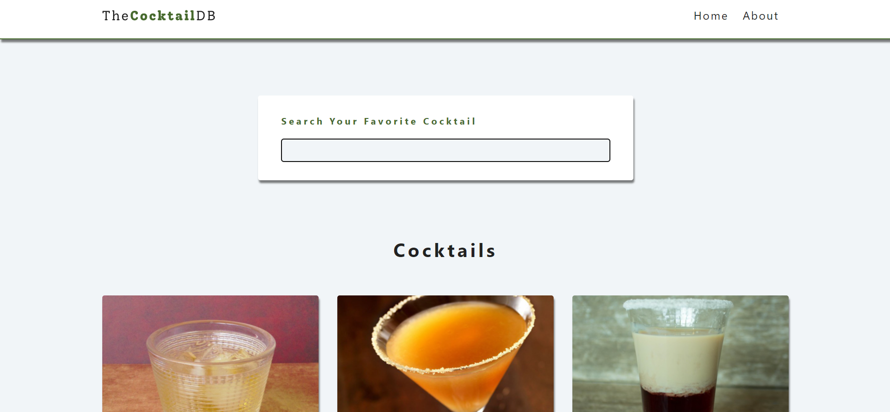
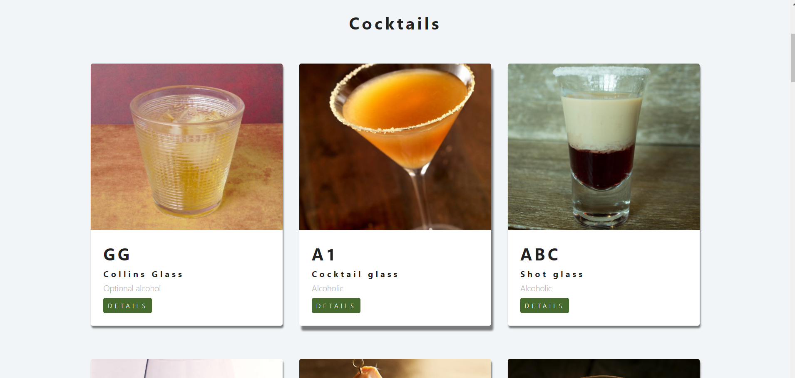
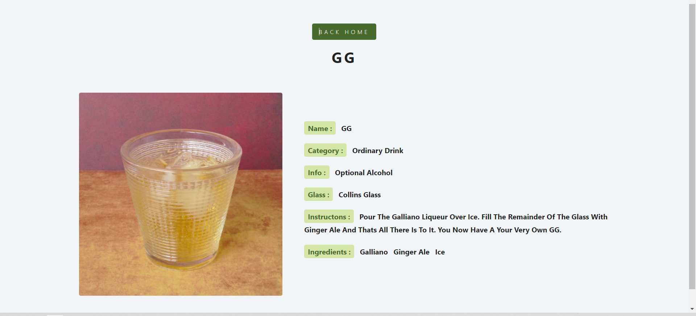

commands used here were:

npm install react-router-dom@5.2.0

version 5.2.0 is used because in this project some old properties of router-dom are used which is supported by this version and not by latest version
 
screenshot of output:
 
 

 
 

 
 

